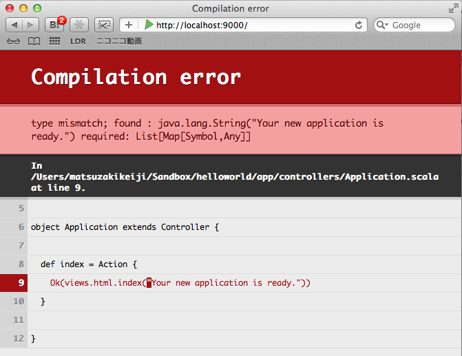
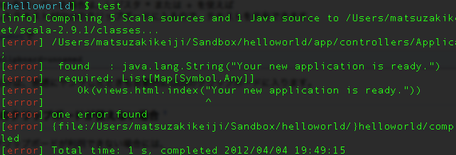
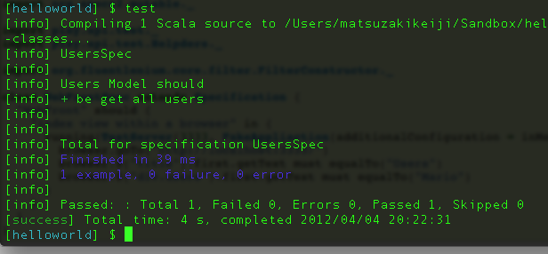
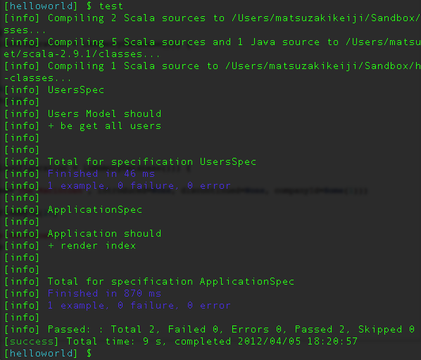
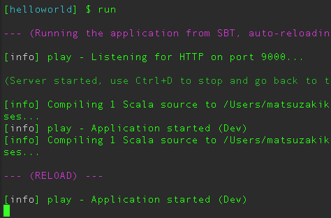
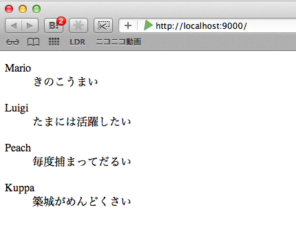

==================================
簡単なアプリケーションを作成しよう
==================================

.. contents::

scaffoldを利用してアプリを作成する
==================================

play consoleの起動確認
-----------------------
.. code-block:: bash

  % play
         _            _ 
   _ __ | | __ _ _  _| |
  | '_ \| |/ _' | || |_|
  |  __/|_|\____|\__ (_)
  |_|            |__/ 
                     
  play! 2.0, http://www.playframework.org
     
  This is not a play application!
        
  Use `play new` to create a new Play application in the current directory, 
  or go to an existing application and launch the development console using `play`.
        
  You can also browse the complete documentation at http://www.playframework.org.j

play new によるアプリケーションのscaffold作成
----------------------------------------------
.. code-block:: bash

  % play new helloworld        
         _            _ 
   _ __ | | __ _ _  _| |
  | '_ \| |/ _' | || |_|
  |  __/|_|\____|\__ (_)
  |_|            |__/ 
                     
  play! 2.0, http://www.playframework.org

  The new application will be created in /Users/matsuzakikeiji/Sandbox/helloworld

  What is the application name? 
  > helloworld

  Which template do you want to use for this new application? 

  1 - Create a simple Scala application
  2 - Create a simple Java application
  3 - Create an empty project

  > 1

  OK, application helloworld is created.

  Have fun!

play new 実行後のディレクトリ構造　
----------------------------------

.. code-block:: bash

  % tree helloworld 
  helloworld
  ├── README
  ├── app
  │   ├── controllers
  │   │   └── Application.scala
  │   └── views
  │       ├── index.scala.html
  │       └── main.scala.html
  ├── conf
  │   ├── application.conf
  │   └── routes
  ├── project
  │   ├── Build.scala
  │   ├── build.properties
  │   └── plugins.sbt
  └── public
      ├── images
      │   └── favicon.png
      ├── javascripts
      │   └── jquery-1.7.1.min.js
      └── stylesheets
          └── main.css

テスト起動
-----------

.. code-block:: bash

  % play run
  [info] Loading project definition from /Users/matsuzakikeiji/Sandbox/helloworld/project
  [info] Set current project to helloworld (in build file:/Users/matsuzakikeiji/Sandbox/helloworld/)
  
  [info] Updating {file:/Users/matsuzakikeiji/Sandbox/helloworld/}helloworld...
  [info] Done updating.                                                                  
  --- (Running the application from SBT, auto-reloading is enabled) ---
  
  [info] play - Listening for HTTP on port 9000...
  
  (Server started, use Ctrl+D to stop and go back to the console...)

登録されたユーザのリストを表示するものを作成する
=================================================

view を以下の形に書き直します。

app/views/index.scala.html
---------------------------

.. code-block:: scala

  @(users: List[Map[Symbol,Any]])
  
  @main("Welcome to Play 2.0") {
    
    <dl>
    @for(i <- users) {
      <dt>users('name)
      </dt>
      <dd>users('message)
      </dd>
    }
    </dl>
                              
  }

play run を実行し、アプリの挙動を確認する
------------------------------------------
controller側で渡しているのは文字列(String)であり、型が異なるために怒られる。

このまま渡している文字列をList[Map[Symbol,Any]]なリストに変えて動作を確認してもよいが、せっかくだしテストコードを書いてみよう。

テストコードを書く
-------------------
アプリの正しい挙動は何か。リストアップしよう。

- Application Rootにアクセスすると登録されているユーザーリストが表示される。
- Controller側でusersをModel側(Users)から取得してViewに渡す
- Users ModelではgetメソッドによりUsersの一覧を提供する(List[Map[Symbol,Any]])
- ViewではController側より渡されたUsersリストを表示する

:: 

  PlayFramework 2.0ではSpecs2を利用してテストを書く形になっている。
  APP_ROOT/testディレクトリにファイルを追加すると、sbtのtrigged execution機能により
  play consoleからtestコマンドを打ち込むだけでテストが実行されるようになる。

テストコード
--------------------
まずはModel側のテストコードを作成しよう。
以下の挙動について確認するコードを作成する。

- Users ModelではgetメソッドによりUsersの一覧を提供する(List[Map[Symbol,Any]])
- Usersの内容(Map)に対し、'name, 'message のkey(Symbol)が存在するか確認をする。

.. code-block:: scala

  package test
  
  import org.specs2.mutable._
  
  import play.api.test._
  import play.api.test.Helpers._
  
  import models._
  
  class UsersSpec extends Specification {
    "Users Model" should {
  
      "be get all users" in {
        running(FakeApplication(additionalConfiguration = inMemoryDatabase("helloworld"))) {
          val users = Users.get()
          users.map { user =>
            user must hasKey('name)
            user must hasKey('message)
          }
        }
      }
    }
  }

テストを実行する
----------------

- View側のパラメータ型エラーによりビルドに失敗する

View側のエラーを抑える
-----------------------
このままでは先に進まない。
テストを終えるまで、Any型でパラメータを受け取るように書き換えよう。
Usersをmapで回す構文も消してしまう。

.. code-block:: scala

  @(users: Any)
  
  @main("Welcome to Play 2.0") {
    Hello world
  }

Users Model の実装をする
------------------------

- テストの形に合わせてUsers Modelを実装する。
- List[Map[Symbol,Any]] を返すget メソッドを書く。

.. code-block:: scala

  package models
  
  case class Users
  
  object Users {
    def get: List[Map[Symbol,Any]] = {
      List(Map('name -> "Mario", 'message -> "きのこうまい"),
           Map('name -> "Luigi", 'message -> "たまには活躍したい"),
           Map('name -> "Peach", 'message -> "毎度捕まってだるい"),
           Map('name -> "Kuppa", 'message -> "築城がめんどくさい")
          )
    }
  }

Users Modelのテストを実行する
------------------------------
play consoleを立ち上げ、testコマンドを打ち込んでみる。

テストが通った！

Users Modelを利用する形にアプリケーションを書きなおす
-------------------------------------------------------
Controllerについてもテストを書きたいが、そのためには
ビルドが通るよう、Controller及びView側のコードを
本来の形に書きなおしてあげる必要がある。

- index.scala.htmlの内容をUsersを使うものに書き戻す

.. code-block:: scala

  @(users: List[Map[Symbol,Any]])
  
  @main("Welcome to Play 2.0") {
    @users.map { user =>
     <dl>
       <dt>@user('name)
       </dt>
       <dd>@user('message)
       </dd> 
     </dl>
    }
  }

- Controller, index routeについてUsersから取得したデータをViewに渡すように書きなおす

.. code-block:: scala

  package controllers
  
  import play.api._
  import play.api.mvc._
  
  import models._
  
  object Application extends Controller {
    
    def index = Action {
      Ok(views.html.index(Users.get()))
    }
    
  }

Controllerのテストを書く
-------------------------
Controller側、View側のコードを書きなおした後、
ビルドが通るようになる(はず)のでController側のテストを書く。

- test/ApplicationSpec.scala ファイルを作成する。

.. code-block:: scala

  package test
  
  import org.specs2.mutable._
  
  import play.api.test._
  import play.api.test.Helpers._
  
  import controllers._
  
  class ApplicationSpec extends Specification {
  
    "Application" should {
      "render index" in {
        running(FakeApplication()) {
          val Some(index) = routeAndCall(FakeRequest(GET, "/"))
  
          status(index) must equalTo(OK)
          contentType(index) must beSome.which(_ == "text/html")
        }
      } 
    }
  }

テストが通るか確認を行う
-------------------------
play consoleでtestコマンドを実行。

テスト通った！Controllerは問題なく動作している。

play run を実行しアプリケーションの動作を確認する
--------------------------------------------------
play consoleでrunコマンドを実行する。
runコマンド実行によりdevelopment状態でアプリケーションが実行される。
Ctrl+Dでアプリケーションを終了し、play consoleでコマンド受付状態にもどる。

ブラウザにてroot(/)にアクセスしてみる。

Users Modelの内容が表示されてる！ヤッター

